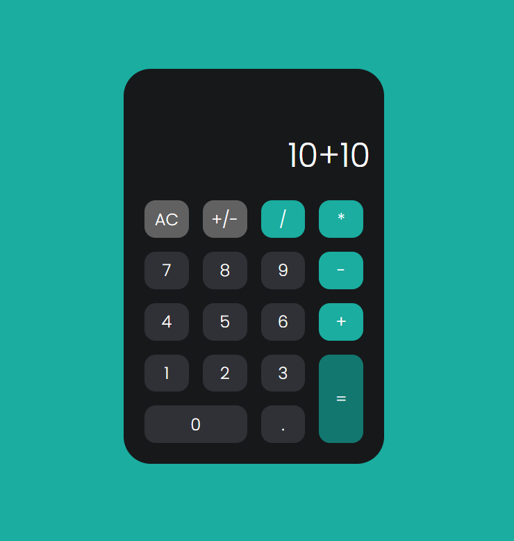

<h1 align="center"> Calculadora com CSS Display GRID + Javascript  </h1>

Calculadora criada com  as lives do <a target="_blank" href="https://www.instagram.com/rodolfomorii/">Rodolfo Mori</a> do DevClub.

 

## 🚀 Tecnologias

Esse projeto foi desenvolvido com as seguintes tecnologias:

- HTML e CSS
- JavaScript

## 💻 Projeto

Mini projeto de uma calculadora.

## 🔖 Layout

Você pode visualizar o layout do projeto através [DESSE LINK](https://www.figma.com/file/85tFb5gWU9PcgmtaGm7LWX/Calculator-App?node-id=74%3A245). É necessário ter conta no [Figma](https://figma.com) para acessá-lo.

## 👨🏻‍💻 Deploy

<a target="_blank" href="https://calculadora-kauamath.netlify.app/"><b>CLICK PARA ACESSAR!</b></a>

## 🌎<i>Onde me encontrar:</i>  

  
   
  

